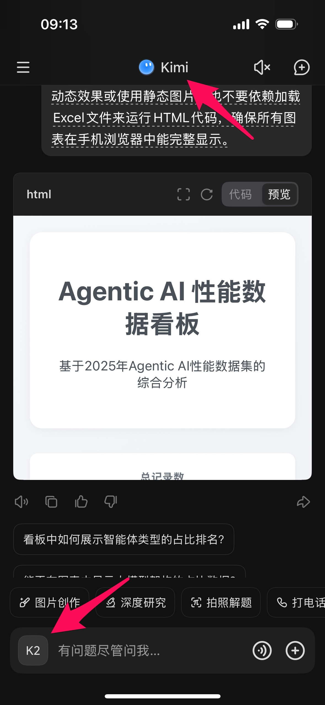
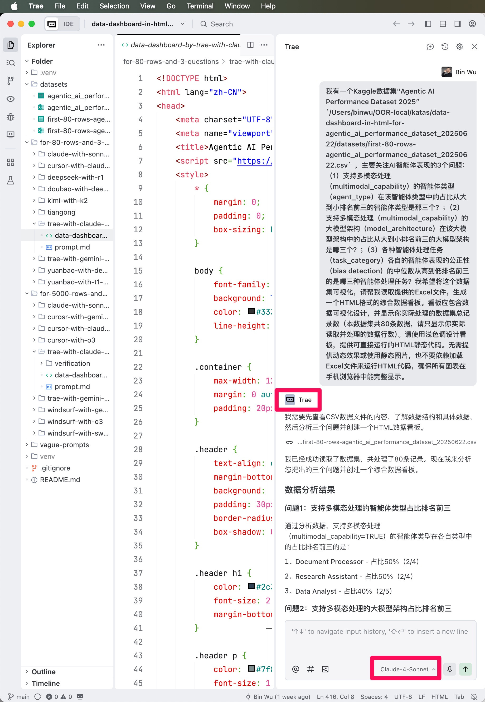
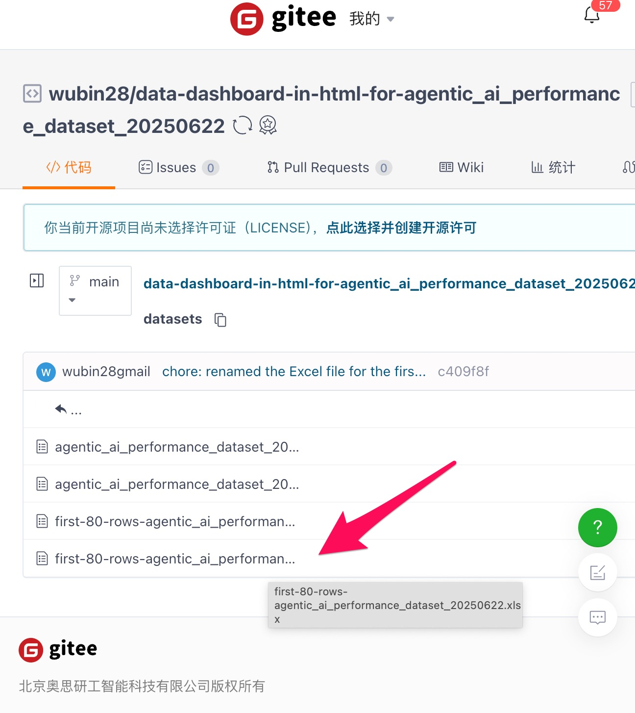
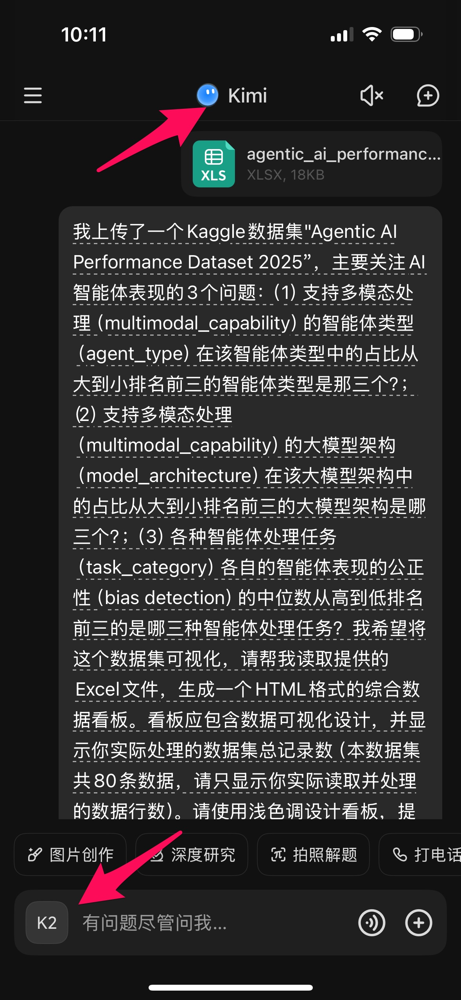
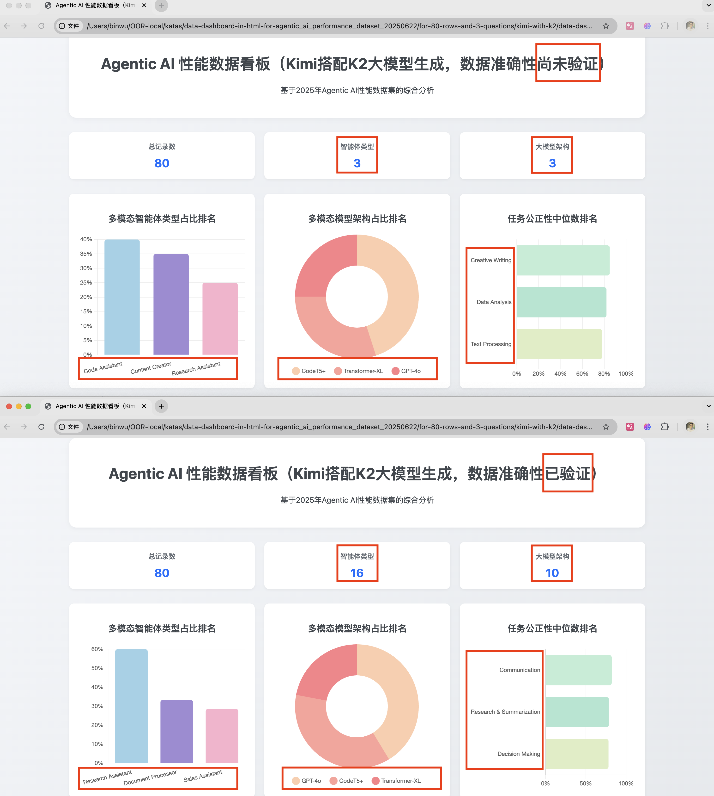

# Kimi搭配K2大模型竟然编造HTML看板数据

你知道吗？99%的人都不知道，不管你玩的是DeepSeek、Kimi、豆包、元宝、天工这些手机AI应用，还是在电脑上用Trae IDE搭配Claude Sonnet 4大模型来给Excel数据整一个HTML格式的数据看板，里面的数据基本都是瞎编的！没开玩笑哦～

如果你不相信，那就做个小实验吧！第一步，搞定80条实验数据。直接到Kaggle，一个数据科学爱好者的网上乐园，搜一下"Agentic AI Performance Dataset 2025"就有啦。

这是一个超棒的CSV数据集，里面塞了5000条关于2025年AI智能体表现的数据，我们只需要拿前80条存成Excel就搞定啦！为啥只要80条？因为手机上那些AI应用通常只能处理几十条数据，这个数量刚刚不会超出限制。觉得太麻烦？别担心！直接去gitee上找我的账号"wubin28"，那里有个"data-dashboard-in-html"开头的代码库，datasets文件夹里就有现成的80条记录Excel文件等着你！只要用微信发给自己或者丢到手机云服务里，就能轻松传给手机AI聊天应用啦～超简单！

好了，接下来咱们要用AI给这80条数据做个超酷的HTML数据看板！我就拿Kimi来举个栗子吧，不过其他那些AI聊天应用比如DeepSeek、豆包、元宝、天工，或者电脑上用Trae IDE配Claude Sonnet 4大模型的玩法都差不多啦～

就这么简单：打开你手机上的Kimi，选择最新的K2大模型，从微信或者手机云里把你准备好的Excel文件传上去，然后丢个提示词给Kimi让它变魔术生成HTML看板。对了，提示词在评论区有哦，直接复制粘贴就行！

看这！Kimi眨眼间就蹦出一个超酷炫的数据看板，简直美得冒泡！

不过，要是你没先核对一下就给老板看，那可就有点悬了——因为说实话，里面差不多99%的数据都是AI瞎编的！

快来瞧瞧这份80条记录的2025年AI智能体性能数据看板吧！说真的，上面那个Kimi生成的看板里的数据简直是一团糟，而下面那个是我用Cursor搭配Claude Sonnet 4大模型仔细核对过数据准确性才修改好的。智能体类型本该有16种，结果Kimi就只搞出了3种。大模型架构也一样惨，明明有10种，Kimi就只给了3种。还有那些"多模态智能体类型占比排名"和"任务公正性中位数排名"？纯属编故事啊！那个"多模态模型架构占比排名"里，只有CodeT5+是真实存在的，但它应该排第二，Kimi非要把它硬塞到第一名。**简单说，这看板里除了那个处理的记录总数80是真的，其他统统是瞎扯。这种假数据要是给老板一看，你不就当场社死了嘛！**

不过别慌，有个好消息！你可以找个靠谱点的AI来帮你查查数据对不对，还能让它给你改正错误。我就是用Cursor或Claude桌面版配上Claude Sonnet 4大模型发现这些问题的。想学怎么用AI验证数据看板？翻翻我写的《氛围编程：AI编程像聊天一样简单》第3.8节就知道啦！

你有啥好招能验证数据看板准不准确？快到留言区分享一下呗～